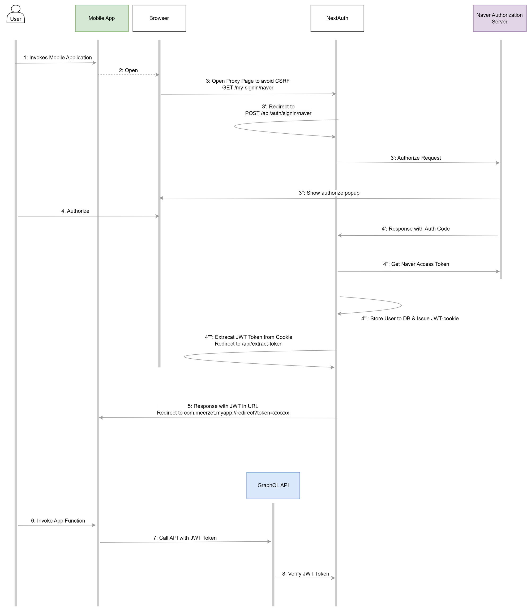

# RN + NextAuth

_3. CSRF Token을 받기 위해 proxy page를 먼저 방문합니다 
4’’’~4’’’’. NextAuth는 JWT Token을 Cookie로만 발급하기 때문에, Cookie에서 JWT Token을 다시 추출합니다.  8. NextAuth는 (JWT 발급 시와 달리) 검증 시에 Authorization Header와 Cookie 방식을 모두 지원합니다._

RN과 Passport로 네이버 로그인을 구현한 예제입니다.

자세한 실행 방법은 client, server의 README를 참고해주세요.
